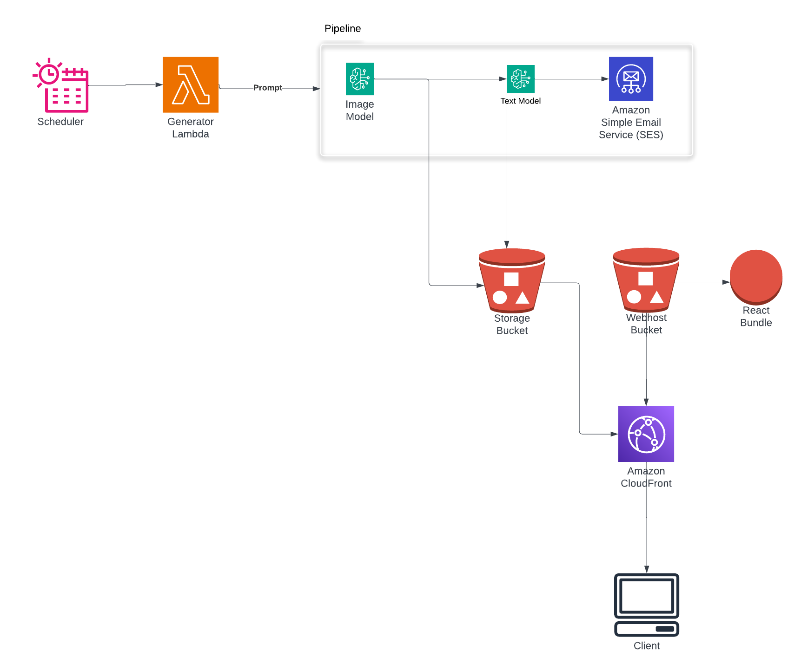

# The Bestiary

## Table of Contents
- [Overview](#overview)
- [Architecture](#architecture)
 - [Generator](#generator)
 - [Webapp](#webapp)
- [Design Choices](#design-choices)

## Overview

The Bestiary is a example project utilizing [AWS Bedrock](https://aws.amazon.com/bedrock) to explore the capabilities of various foundation models. 

There are two parts to the project: 
*  Generator
*  Webapp

## Architecture

### [Generator](generator/README.md)

The generator function is a lambda that is meant to be run on a cron schedule using event bridge scheduler. 

It invokes an image model with a random set of prompts to generate a mythical creature.
That image is then uploaded to a bucket, and passed to another multi-media model to scientifically describe as a fact card, a la zoobooks. The fact card is also saved to an S3 bucket.

This image/fact card is then emailed to the recipient(s). 

### [Webapp](webapp/README.md)

The webapp is to allow users to easily browse through all of the generated creatures.
It's a react app served from an S3 bucket proxied through Cloudfront, which mediates access to the bucket. 

### Design Choices
Coming from a background working mostly with small teams, I tend to favor reliability, scalability, simplicity and cost over performance. While all of the SSR frameworks (Next, SvelteKit, RSC, Qwik/QwikCity) are great and really impressive when it comes to performance, they do add an extra layer of compute and concurrency to contend with. 
I actually started writing this project with Qwik for the front end, and while I liked the framework, I kept thinking how much simpler it could be. 

By serving a cached client bundle off the edge with Cloudfront, there's no web tier to scale or manage, and costs are lower than containers or lambdas would be. 

Likewise, using S3 as a Cloudfront origin allows for a very high cache hit rate.
Cloudfront's proxy behavior allows for this to be a static site with dynamic content.  

By prebuilding a manifest and using compound identifiers in S3 key paths, I can store and expose searchable/queryable information easily, durably, and cheaply. 

While it won't scale forever, the bottleneck in this architecture is on the size of the image catalogue - and generating one a day, it'll be a few years till I have to even begin to worry on that. 
